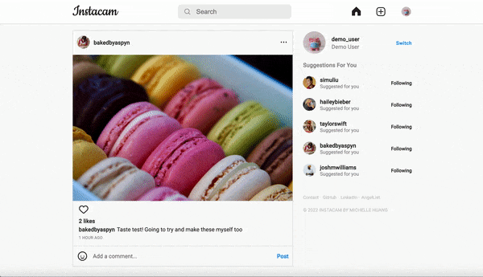

# Instacam

[Instacam](https://the-instacam.herokuapp.com/#/login) is a full stack web application clone of Instagram where users can publicly share photos that can be viewed, liked by, and commented on by other users.

## Technologies 
* Ruby on Rails
* React/Redux
* PostgreSQL
* JavaScript
* HTML5 / CSS

## Features
### New User Account Creation and Login

### Create, View, Edit, and Delete Posts

### Like and Unlike Posts

### Create and Delete Comments on Posts

### User Profile and Dashboard of All Posts

### Search for Other Users

## Bonus Features
* Users can see a list of those who liked their posts in the navigation bar
* Users can follow other users
* Mobile friendly