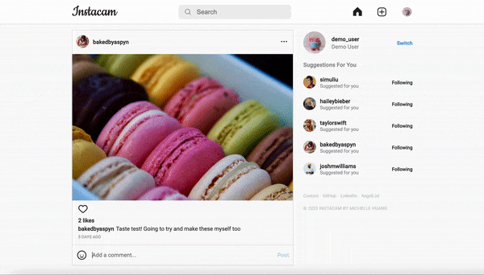

# Instacam

[Instacam](https://the-instacam.herokuapp.com/#/login) is a full stack web application clone of Instagram where users can publicly share photos that can be viewed, liked by, and commented on by other users.

## Technologies 
* Ruby on Rails
* React / Redux
* PostgreSQL
* AWS
* JavaScript / AJAX / JBuilder
* HTML5 / CSS
* Heroku 

## Features
* ### New User Account Creation and Login


* ### Create, View, Edit, and Delete Posts


Users are able to create a new post by uploading a photo from their computer and writing a caption to go alongside it. Prior to sharing, users are able to preview their post's photo and caption as well. This feature is made possible with the following logic:

```
handleFile(e) {
    const file = e.currentTarget.files[0];
    const fileReader = new FileReader();
    fileReader.onloadend = () => {
        this.setState({photoFile: file, photoUrl: fileReader.result});
    };
    
    if (file) {
        fileReader.readAsDataURL(file);
    };
}

handleSubmit(e) {
    e.preventDefault();
    const formData = new FormData();
    formData.append('post[caption]', this.state.caption);
    if (this.state.photoFile) {
        formData.append('post[photo]', this.state.photoFile)
    };
    this.props.createPost(formData).then(() => this.handleSuccessSubmit()).fail(() => thissetState({errors: this.props.errors}))
}

handleSuccessSubmit() {
    if (this.props.history.location.pathname === '/') {
        this.props.history.replace('/')
    } else if (this.props.history.location.pathname === `/users/${this.props.currentUser.id}`) {
        this.props.fetchUser(this.props.currentUser.id)
        this.props.history.replace(`/users/${this.props.currentUser.id}`)
    }
    this.props.closeModal();
}
```

* ### Like and Unlike Posts


* ### Create and Delete Comments on Posts


* ### User Profile and Dashboard of All Posts


* ### Search for Other Users


Users are able to search for other users on Instacam through the search bar. This feature is made possible with an effective filtering function:
```
handleFilter(e) {
    this.setState({searchParams: e.currentTarget.value})
    const searchWord = e.currentTarget.value;
    const newFilter = this.props.users.filter((user) => {
        return user.username.toLowerCase().includes(searchWord.toLowerCase());
    });
    if (searchWord === "") {
        this.setState({ searchedUsersArray: []})
    } else {
        this.setState({ searchedUsersArray: newFilter }, () => {this.showElement()});
    }
}
``` 

## Bonus Features
* Users can see a list of those who liked their posts in the navigation bar
* Users can follow other users
* Mobile friendly